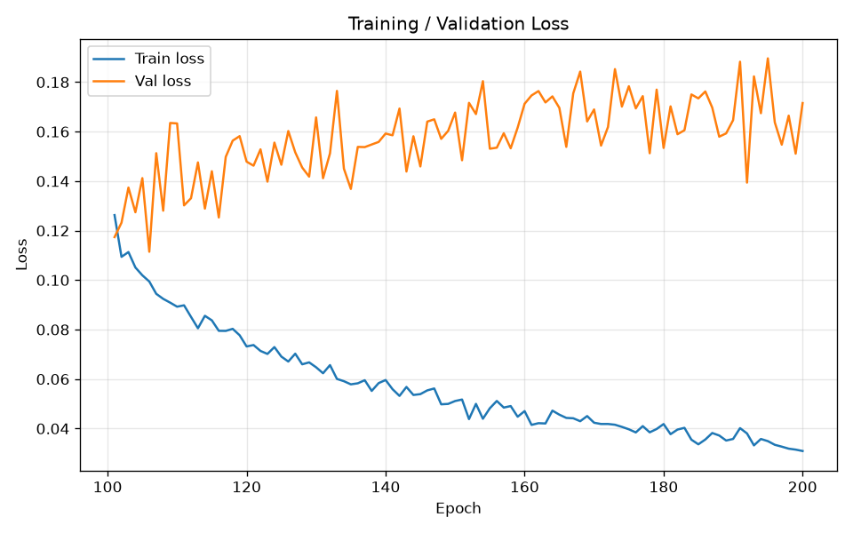
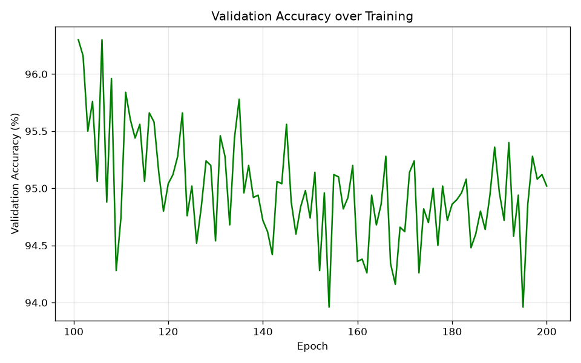
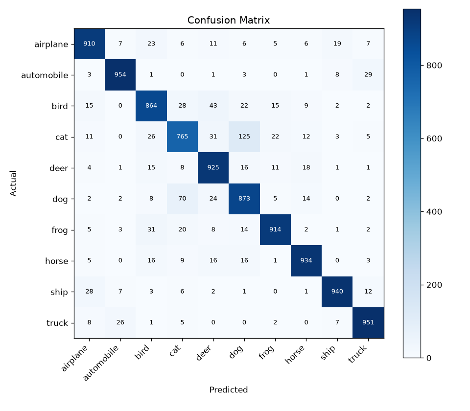

# 04-resnet18-200epochs

## Result summary
- **Test accuracy:** 90.30%
- **Test loss:** 0.375
- **Best val accuracy (during training):** 96.30%
- **Epochs trained (total, including any resumed prior runs):** 200

## Per-class metrics
| Class | Precision | Recall | F1 |
|---|---|---|---|
| airplane | 0.918 | 0.910 | 0.914 |
| automobile | 0.954 | 0.954 | 0.954 |
| bird | 0.874 | 0.864 | 0.869 |
| cat | 0.834 | 0.765 | 0.798 |
| deer | 0.872 | 0.925 | 0.898 |
| dog | 0.811 | 0.873 | 0.841 |
| frog | 0.937 | 0.914 | 0.926 |
| horse | 0.937 | 0.934 | 0.935 |
| ship | 0.958 | 0.940 | 0.949 |
| truck | 0.938 | 0.951 | 0.944 |

**Macro avg** — Precision: 0.903, Recall: 0.903, F1: 0.903
**Weighted avg** — Precision: 0.903, Recall: 0.903, F1: 0.903

## Plots

## Notes
(fill in: what changed on this branch, what you expected, what actually happened)

## Raw training log
Full console output: `logs/04-resnet18-200epochs-training_log.txt`
