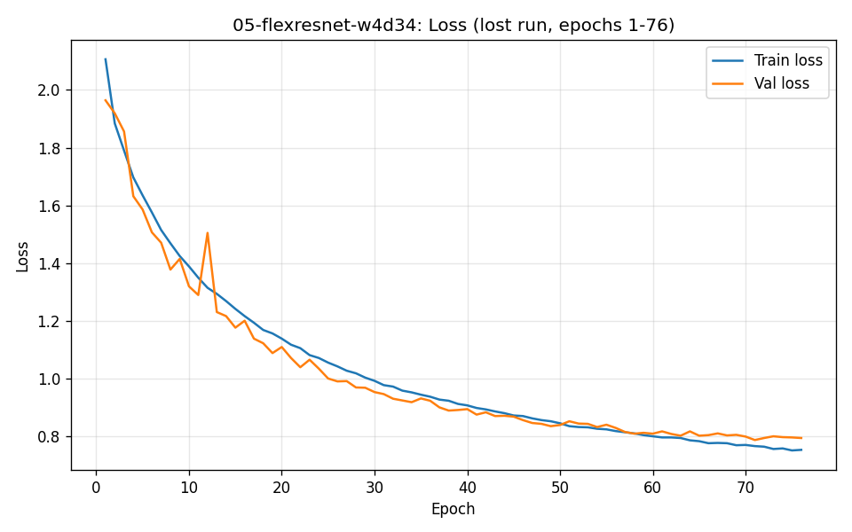
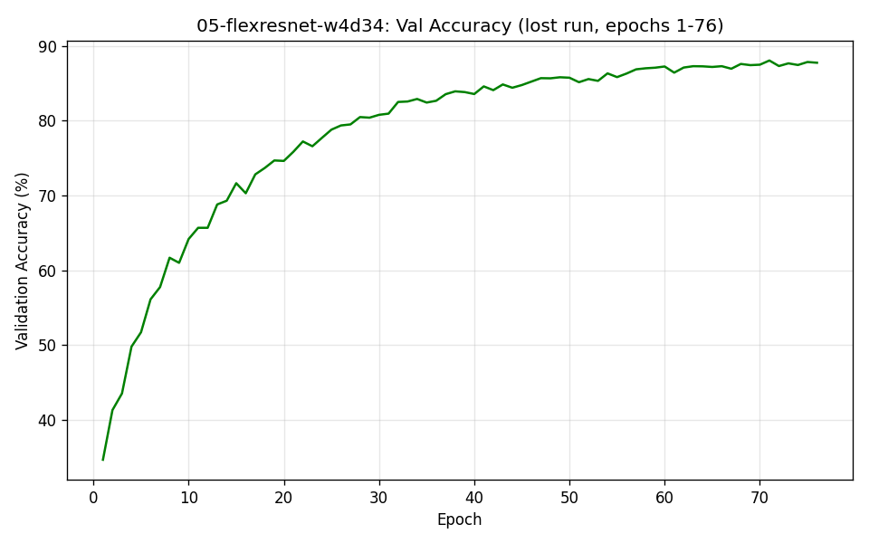

# 05-flexresnet-w4d34-100epochs

## Status: Incomplete — training data lost mid-run

## What happened
This branch trained a WideResNet-34-4-style FlexResNet (width_factor=4,
blocks_per_stage=4, dropout=0.3) with cosine LR scheduling and label smoothing.
Training progressed well through epoch 76 (see real recovered numbers below),
reaching **88.04% validation accuracy at epoch 71**, still climbing.

The run was lost before completion due to two consecutive infrastructure
failures: a local PC power interruption during one attempt, and both a Kaggle
and a Colab session disconnecting before the checkpoint (`weights/latest.pth`)
was committed and pushed to the repository. Since the checkpoint had not yet
been pushed at either failure point, the actual trained weights are
unrecoverable — only the console log output survived (copy-pasted during the
session), which is what this report is reconstructed from.

**No final test accuracy exists** for this run — training never reached
epoch 100, and the final evaluate-on-test-set step never executed.

## What this led to
This loss is the direct reason `train.py` was updated to auto-commit and push
`weights/latest.pth` every 10 epochs during training (see commit
"fix: auto-push checkpoint every 10 epochs to prevent losing progress on
disconnect"). All branches after this one are protected against losing more
than ~9 epochs of progress to a disconnect.

## Recovered training curve (epochs 1-76, real data from the session log)

The trajectory was healthy: steady, low-noise improvement, train/val gap
staying reasonable (no overfitting divergence visible), consistent with the
cosine LR schedule doing its job as it approached its later, smaller-step
phase.

## Comparison context
For reference, `03-resnet-blocks` (plain ResNet-18, no dropout/scheduler/
label smoothing) reached its final **90.52% test accuracy** after a full
100 epochs, and was already past 82% by roughly this same epoch range. This
run (with more depth, width, and regularization) was tracking slightly behind
03 at the same epoch count — expected, since dropout deliberately slows early
convergence in exchange for better generalization later. Based on the
trajectory shown here, a completed run likely would have closed that gap and
potentially exceeded 03's result by epoch 100, but this cannot be confirmed
without a completed, tested run.

## Next steps
Given time constraints, this architecture was not re-run from scratch a
second time. Instead, effort moved to `07-pretrained-resnet56-finetune`,
which starts from real, published pretrained CIFAR-10 weights (93.39% test
accuracy baseline) and fine-tunes briefly — a faster, lower-risk path to a
strong final number given the remaining time budget.
