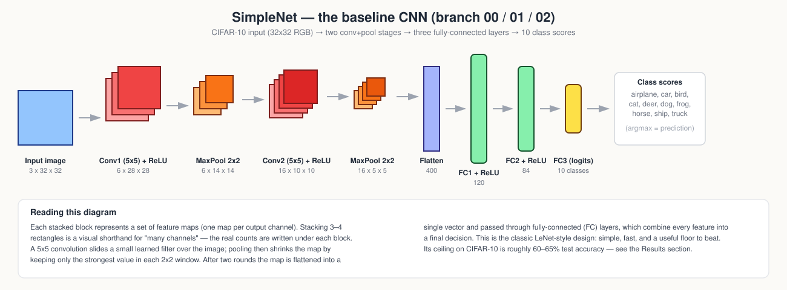
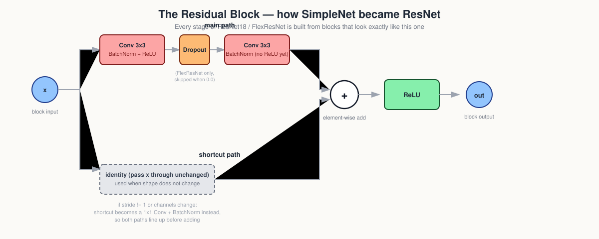
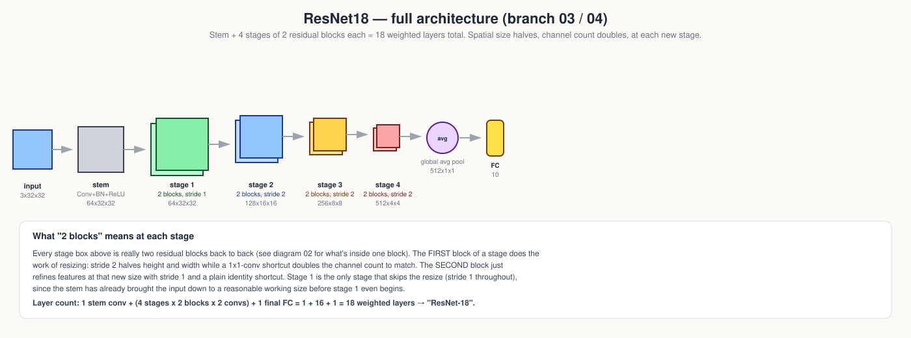
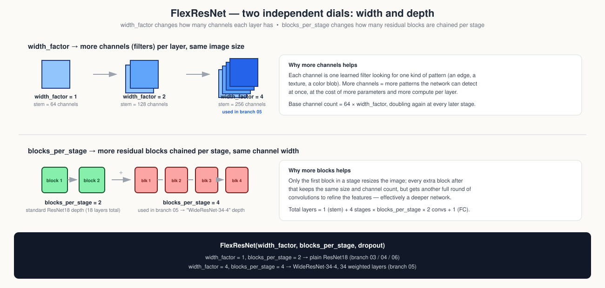
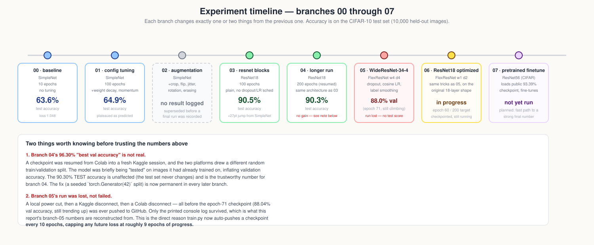

# InMindAcademyCNN — Architecture & Results Report

A guided walkthrough of every network trained in this repo, from a five-line
CNN to a fine-tuned ResNet, with diagrams for each architectural idea and the
real results pulled from every branch (`00` through `07`).

> Source: [github.com/maya-fakih/InmindAcademyCNN](https://github.com/maya-fakih/InmindAcademyCNN),
> all 8 branches. Dataset: CIFAR-10 (60,000 32x32 color images, 10 classes,
> 50,000 train / 10,000 test).

---

## 1. Key terms, in plain language

| Term | What it means here |
|---|---|
| **Convolution (Conv)** | A small learned filter (e.g. 3x3 or 5x5 pixels) slides across the image and produces one "feature map" per filter — think of it as a pattern detector for edges, textures, or colors. |
| **Channel / feature map** | One output of one filter. "64 channels" means 64 different pattern-detectors ran over the image, each producing its own map. |
| **Kernel size** | How big the sliding filter is (3x3, 5x5, 1x1...). |
| **Stride** | How many pixels the filter moves each step. Stride 2 roughly halves the output's height and width. |
| **Pooling (MaxPool)** | Shrinks a feature map by keeping only the strongest value in each small window — a cheap way to downsample and add a little position-invariance. |
| **BatchNorm** | Rescales each channel's activations to a stable range (mean 0, std 1, then a learned scale/shift) before the next layer sees them. Makes training faster and more stable. |
| **ReLU** | `max(0, x)`. The non-linearity that lets stacked convolutions represent more than a single linear transform. |
| **Residual / skip connection** | Instead of forcing a block to learn a full transformation, it only has to learn the *difference* from its input; the input is added back at the end (`out = F(x) + x`). This is what lets ResNets go much deeper than plain CNNs without training collapsing. |
| **Dropout** | Randomly zeroes out some activations during training only, forcing the network not to over-rely on any single feature. `Dropout2d` (used here) zeroes whole channels, since single pixels alone carry little meaning after a convolution. |
| **Label smoothing** | Instead of training the model to output 100% confidence on the correct class, the target is softened (e.g. 97% correct / 1% each on 3 others). Reduces overconfidence and improves generalization. |
| **Cosine LR schedule** | The learning rate follows a cosine curve down to ~0 over training, instead of staying fixed — large steps early, very small refinement steps late. |
| **Data augmentation** | Randomly warping the *view* of each training image (crop, flip, color jitter, rotation, erasing a patch) every epoch, without creating new images, so the model can't just memorize exact pixels. |
| **Validation / test split** | Validation data is checked during training to monitor progress (and pick the best checkpoint); test data is only touched once, at the very end, for the number that actually counts. |
| **Checkpoint** | A saved snapshot of the model's weights (and optimizer state), so training can resume instead of restarting from scratch. |

---

## 2. SimpleNet — the baseline (branches `00`, `01`, `02`)



SimpleNet is a classic LeNet-style CNN: two convolution+pool stages followed
by three fully-connected layers. It has no batch normalization, no residual
connections, and no regularization beyond whatever the optimizer provides.
It exists to answer one question: *what's the floor?* — the minimum a
reasonable CNN can do on CIFAR-10 with almost no architectural sophistication.

```
Input (3x32x32)
  -> Conv 5x5 (6 filters) -> ReLU -> MaxPool 2x2      # 6x14x14
  -> Conv 5x5 (16 filters) -> ReLU -> MaxPool 2x2     # 16x5x5
  -> Flatten                                          # 400
  -> FC 120 -> ReLU
  -> FC 84  -> ReLU
  -> FC 10  (class scores)
```

- **Branch `00` (baseline):** 10 epochs, batch size 8, no tuning.
- **Branch `01` (config tuning):** same architecture, 100 epochs, larger
  batch (128), added momentum and weight decay. The training notes correctly
  predicted this would plateau around 60–70% — it plateaued at ~65%.
- **Branch `02` (augmentation):** added a full augmentation pipeline (random
  crop, horizontal flip, color jitter, rotation, random erasing) on top of
  SimpleNet. No final run was logged on this branch before the project moved
  on to residual architectures, so there's no accuracy number to report here
  — the augmentation pipeline itself carries forward unchanged into every
  later ResNet branch instead.

A small, shallow, fully-connected-heavy network like this simply doesn't have
the right inductive bias for images at scale — which motivates the next
section.

---

## 3. The residual block — how SimpleNet became ResNet (branches `03`+)



The single biggest architectural change in this project is the move to
**residual blocks**. A plain stack of convolutions gets *harder* to train as
it gets deeper (gradients vanish, optimization degrades) — residual
connections fix this by letting each block learn a small correction on top
of its input rather than a full transformation from scratch:

```
out = ReLU( ConvBNConvBN(x) + shortcut(x) )
```

- If the block doesn't change the shape (same channels, stride 1), the
  shortcut is just the identity — `x` passes through untouched.
- If the block *does* change the shape (new stage, stride 2, more channels),
  the shortcut becomes a 1x1 convolution + BatchNorm, so both paths line up
  before the addition.
- The final ReLU is applied *after* the addition, not inside the second
  conv — this is what lets the block represent a true identity mapping when
  needed.
- `Dropout2d` sits between the two convolutions inside each block starting
  from branch `05` onward, dropping whole channels rather than single pixels.

---

## 4. ResNet18 — full architecture (branches `03`, `04`)



ResNet18 is four "stages" of residual blocks stacked after a stem
convolution. Each stage doubles the channel count and halves the spatial
resolution (except stage 1, which keeps the stem's resolution):

| Stage | Blocks | Stride | Output shape |
|---|---|---|---|
| stem | — | 1 | 64 x 32 x 32 |
| stage 1 | 2 | 1 | 64 x 32 x 32 |
| stage 2 | 2 | 2 | 128 x 16 x 16 |
| stage 3 | 2 | 2 | 256 x 8 x 8 |
| stage 4 | 2 | 2 | 512 x 4 x 4 |
| global avg pool | — | — | 512 x 1 x 1 |
| FC | — | — | 10 |

**Layer count:** 1 stem conv + (4 stages × 2 blocks × 2 convs) + 1 FC =
**18 weighted layers** → "ResNet-18".

- **Branch `03` (resnet blocks):** plain ResNet18, no dropout, no LR
  schedule, no label smoothing, 100 epochs. **Test accuracy: 90.52%**
  (test loss 0.375) — a +27 point jump over SimpleNet from architecture
  alone.
- **Branch `04` (200 epochs):** identical architecture, resumed and trained
  to 200 total epochs. **Test accuracy: 90.30%** (test loss 0.375) —
  essentially flat versus branch 03, meaning this architecture had already
  converged well before epoch 100 and extra epochs alone weren't buying
  anything further.

> ⚠️ **A logged number to distrust:** branch 04's training log also reports
> a "best validation accuracy" of 96.30%. That figure is contaminated — a
> checkpoint was resumed from a Colab session into a fresh Kaggle session,
> and the two platforms drew a *different* random train/validation split
> before `get_loaders()` was seeded. For a stretch of training the model was
> effectively being validated on images it had already trained on. The
> **test accuracy (90.30%) is unaffected**, since the test set is fixed and
> untouched — that's the number to trust for branch 04. The fix
> (`torch.Generator().manual_seed(42)` in `get_loaders()`) is now permanent
> in every branch after this one.

### Per-class results (branch 04, 200 epochs)

| Class | Precision | Recall | F1 |
|---|---|---|---|
| airplane | 0.918 | 0.910 | 0.914 |
| automobile | 0.954 | 0.954 | 0.954 |
| bird | 0.874 | 0.864 | 0.869 |
| cat | 0.834 | 0.765 | 0.798 |
| deer | 0.872 | 0.925 | 0.898 |
| dog | 0.811 | 0.873 | 0.841 |
| frog | 0.937 | 0.914 | 0.926 |
| horse | 0.937 | 0.934 | 0.935 |
| ship | 0.958 | 0.940 | 0.949 |
| truck | 0.938 | 0.951 | 0.944 |

*Macro / weighted avg: precision 0.903, recall 0.903, F1 0.903.* The weakest
class by far is **cat** (recall 0.765) — most often confused with dog, which
tracks with the two lowest-recall classes in the table.

---

## 5. FlexResNet — generalizing width and depth (branches `05`, `06`)



`ResNet18` was refactored into `FlexResNet(num_classes, width_factor,
blocks_per_stage, dropout)` — the exact same building blocks as section 3–4,
but with two independent dials instead of fixed constants:

- **`width_factor`** multiplies the base channel count (64) at every stage.
  `width_factor=1` reproduces plain ResNet18 (64 base channels);
  `width_factor=4` produces 256 base channels — 4x more filters at every
  layer, at real memory/compute cost, in exchange for more pattern capacity.
- **`blocks_per_stage`** controls how many residual blocks are chained per
  stage. Only the *first* block in a stage resizes the input (stride 2 +
  channel change); every additional block after that keeps the same shape
  and just adds another round of refinement.

```
FlexResNet(width_factor=1, blocks_per_stage=2)  == plain ResNet18   (18 layers)
FlexResNet(width_factor=4, blocks_per_stage=4)  == WideResNet-34-4  (34 layers)
```

Both branches `05` and `06` add the same three training upgrades on top of
the architecture: **cosine LR scheduling**, **label smoothing**, and
**dropout (0.3)** inside each residual block.

### Branch `05` — WideResNet-34-4, 100 epoch target

`width_factor=4, blocks_per_stage=4, dropout=0.3` — 4x wider and much
deeper than plain ResNet18, in the same family as the well-known WRN-28-10
architecture from the WideResNet paper, just at a different width/depth
tradeoff point.

**Status: incomplete — the trained weights were lost**, not because training
failed, but because of two consecutive infrastructure failures: a local
power interruption on one attempt, then both a Kaggle and a Colab session
disconnecting before `weights/latest.pth` was ever committed and pushed to
GitHub. Only the printed console log survived (copy-pasted live during the
session), and this report's numbers for branch 05 are reconstructed from
that log alone.

- Recovered training curve covers **epochs 1–76** (real data, not
  estimated).
- **Best recorded validation accuracy: 88.04% at epoch 71**, still
  climbing steadily — the train/val gap stayed healthy with no sign of
  overfitting.
- **No test accuracy exists** for this run: training never reached epoch
  100, and the final test-set evaluation step never executed.
- For reference, branch `03` (plain ResNet18, no regularization) was already
  past 82% by this same epoch count, so branch 05 was tracking *behind* 03
  at matching epochs — expected, since dropout deliberately slows early
  convergence in exchange for better generalization later. The trajectory
  suggests a completed run likely would have closed that gap and possibly
  beaten branch 03's 90.52%, but this can't be confirmed without a finished,
  tested run.

**Direct consequence:** this loss is the reason `train.py` was changed to
auto-commit and push `weights/latest.pth` every 10 epochs during training.
Every branch after this one can lose at most ~9 epochs of progress to a
disconnect, not an entire run.

### Branch `06` — the same optimizations, back on the original 18-layer shape

`width_factor=1, blocks_per_stage=2, dropout=0.3` — deliberately *not*
wider or deeper than plain ResNet18; the goal here is to isolate the effect
of the three training upgrades (dropout, cosine LR, label smoothing) from
the architecture-size question that branch 05 was exploring.

**Status: in progress.** As of this report, training has been checkpointed
through **epoch 60 of a 200-epoch target**, committed periodically
(`wip: checkpoint at epoch 10/20/30/40/50/60`) using the auto-push fix that
branch 05's loss motivated. No final test accuracy exists yet.

---

## 6. Branch `07` — fine-tuning a real pretrained ResNet56

Rather than training a bigger network from scratch a second time given the
remaining time budget, branch `07` takes a different, lower-risk path: start
from a **real, published, pretrained CIFAR-10 checkpoint** and fine-tune it
briefly.

- **Model:** `resnet56` from the well-known
  [`akamaster/pytorch_resnet_cifar10`](https://github.com/akamaster/pytorch_resnet_cifar10)
  reference implementation — the CIFAR-specific ResNet design from the
  original ResNet paper (not the ImageNet variant most tutorials copy,
  which has the wrong parameter count for CIFAR).
- **Architecture shape:** 56 weighted layers, ~0.85M parameters, 3 stages of
  9 `BasicBlock`s each (16 → 32 → 64 base channels — note this is a
  *narrower* base than the ImageNet-style ResNet18 used elsewhere in this
  repo, by design of the original CIFAR ResNet paper), with an "option A"
  identity shortcut that zero-pads channels instead of using an extra
  learned 1x1 convolution.
- **Pretrained baseline:** 93.39% test accuracy, loaded directly from the
  published checkpoint (with a `module.` prefix stripped, since it was
  originally saved from multi-GPU training).
- **Fine-tuning plan:** a short additional training run (config currently
  set to 20–30 epochs) with cross-entropy + label smoothing and SGD,
  intended as a fast path to a strong final number without the multi-day
  risk profile of training a wide/deep network from zero.

**Status: not yet run.** No weights, logs, or results have been committed to
this branch yet — it exists as the planned next experiment.

---

## 7. Full results summary



| Branch | Model | Epochs | Key changes | Test accuracy | Test loss | Status |
|---|---|---|---|---|---|---|
| `00` baseline | SimpleNet | 10 | none | **63.59%** | 1.048 | complete |
| `01` config tuning | SimpleNet | 100 | +momentum, weight decay, larger batch | **64.93%** | 1.132 | complete |
| `02` augmentation | SimpleNet | — | +crop/flip/jitter/rotation/erasing | no result logged | — | superseded |
| `03` resnet blocks | ResNet18 | 100 | residual blocks + BatchNorm | **90.52%** | 0.375 | complete |
| `04` 200 epochs | ResNet18 | 200 | same arch., resumed training | **90.30%** | 0.375 | complete |
| `05` WideResNet-34-4 | FlexResNet w4·d4 | 100 (target) | dropout, cosine LR, label smoothing | 88.04% val @ epoch 71 (no test score) | — | **lost** |
| `06` ResNet18 optimized | FlexResNet w1·d2 | 200 (target) | same optimizations, original depth | — | — | **in progress** (epoch 60/200) |
| `07` pretrained finetune | ResNet56 (CIFAR) | 20–30 (planned) | fine-tune a real 93.39% pretrained checkpoint | not run yet | — | **planned** |

**Headline takeaway:** the single biggest jump in this whole project is
architectural — swapping SimpleNet for ResNet18 (branch `00`/`01` → `03`)
is worth roughly **+26 points** of test accuracy. Everything after that
(more epochs, dropout, LR scheduling, label smoothing, width/depth scaling)
is fine-tuning around the edges of a much stronger foundation, and branches
`05`–`07` were still in flight as of this report.

---

## 8. Operational lessons learned (from `HOWTO.md`)

A few non-architectural but hard-won fixes, since they materially affected
which results above can be trusted:

- **Checkpoint auto-push every 10 epochs** — added directly because of
  branch 05's loss; caps future data loss at ~9 epochs.
- **Seeded train/val split** (`torch.Generator().manual_seed(42)`) — added
  directly because of branch 04's validation-accuracy contamination when
  resuming across platforms.
- **Kaggle has no Google Drive** — dataset paths point at a local
  `data/cifar10/` folder and CIFAR-10 simply re-downloads each session
  (~170MB) rather than fighting Kaggle's read-only dataset mount format.
- **Git identity must be set in every fresh cloud session** or the
  auto-commit step silently fails with "Please tell me who you are."

---

## 9. Where the diagrams live

| File | Shows |
|---|---|
| `diagrams/01_simplenet_architecture.svg` | Full SimpleNet, layer by layer |
| `diagrams/02_residual_block_detail.svg` | Inside one residual block: main path, shortcut path, the add |
| `diagrams/03_resnet18_architecture.svg` | Full ResNet18: stem through 4 stages to the classifier |
| `diagrams/04_width_and_depth_scaling.svg` | How `width_factor` and `blocks_per_stage` each scale the network |
| `diagrams/05_experiment_timeline.svg` | All 8 branches side by side with results and status |
